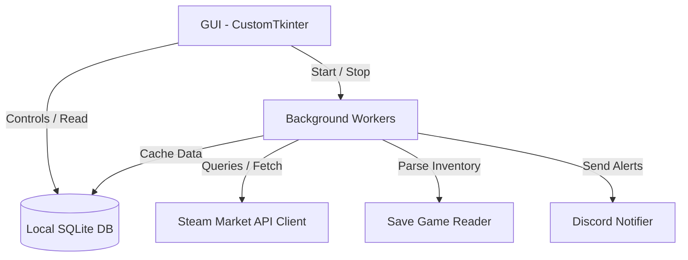

# Architecture Overview

This document outlines the high-level architecture and design patterns used in the Steam Market Tracker.

## Overview

The application is structured around a clear separation of concerns, separating the graphical user interface, background operations, data storage, and external API calls.

---

## Core Components

### 1. Graphical User Interface (`src/gui/`)
- **`app.py`**: The main controller window. It orchestrates the starting of worker threads, initializes UI configurations, handles window close signals, and updates footer timestamps.
- **`add_dialog.py`**: A simple modal window allowing users to add new items to the tracking list with custom color highlights.
- **`item_card.py`**: A reusable card component representing a single tracked item. It displays price history charts (using `matplotlib`), inventory counts, current buy/sell status, and includes controls for configuring alert thresholds.

### 2. Background Workers (`src/worker.py`)
- Background processes run inside daemon threads to ensure the UI remains responsive.
- **`PriceWorker`**: Polls the Steam Community Market for current pricing (bid, ask, and volumes) for all tracked items. Runs on a scheduled hourly interval.
- **`ListingWorker`**: Retrieves catalog items and syncs item rarity and color highlights from the web directory.
- Features overlap guards and safe interruption handlers (`stop_event`) to shut down threads cleanly.

### 3. Local Storage & Cache (`src/database.py`)
- Houses the SQLite controller. All tracked items, historical prices, snapshots, inventory data, and downloaded image binary blobs are stored here.
- Using a database ensures that the app loads instantly without redundant network calls, and protects cached data between sessions.

### 4. API Request Client (`src/steam_api.py`)
- Standardizes requests to Steam Community Market endpoints.
- Uses `requests.Session` to reuse TCP connections.
- Embeds retry policies and exponential backoffs to handle server rate warnings gracefully.

### 5. Inventory Save Integration (`src/save_reader.py`)
- Interfaces with local game save files (`SaveFile_Live.es3`).
- Decodes inventory data block information to retrieve currently owned item indices.

### 6. Discord Notifier (`src/notifier.py`)
- Handles formatting and posting JSON alerts to a configured Discord webhook when tracked items drop below a user's defined alert threshold.
